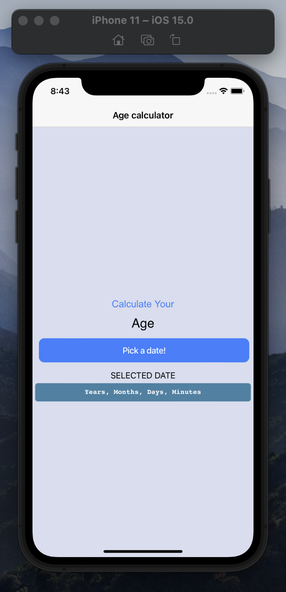
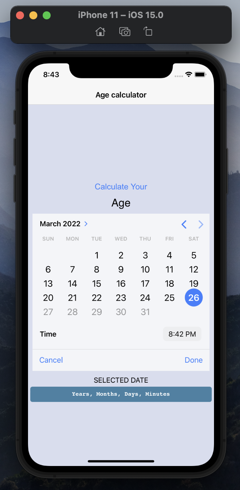
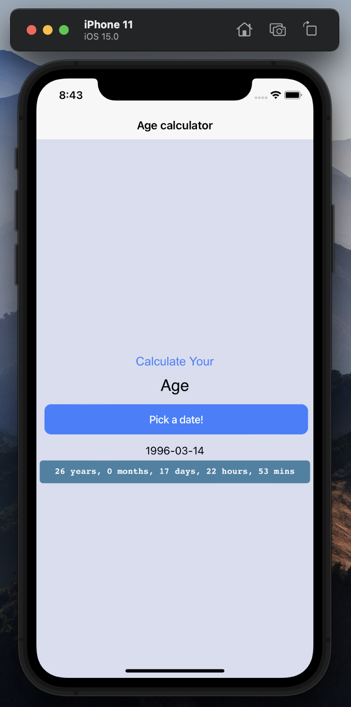

# assignment-4
This project is made for having a practical usage of DatePicker usage for mobile applications. Built with Ionic framework within the power of ReactJS.

## ⚒ How To?

To develope a mobile application with Ionic framework we have couple of things to do before we start. Let me describe each of those steps in particular;
 - Node environment setup
 - Ionic setup
 - Development
 - Debug & Build

#### Node environment setup
For OSX environment you can install the node environment within the use of following commands
```
$ brew update
$ brew install node
```
if you are not on OSX environment or looking for more advanced installation follow this [article](https://www.newline.co/@Adele/how-to-install-nodejs-and-npm-on-macos--22782681).

#### Ionic setup

Following command will install the ionic framework for you
```
$ npm install -g @ionic/cli
```
If it did not worked for you, you can always check official [documentation](https://ionicframework.com/docs/intro/cli).

#### Development

to create a new ionic application, below command will work for you!
```
$ ionic start <app name> <template: tabs | sidemenu | blank>
```

I preferred React framework for frontend side. You may prefer another supported framework.

Since this is a single page application, Home page and pre-developed component of ExploreContainer works well for us! To create all of our logic we use TypeScript. For UI side, we have bunch of solution from [Ionic Components](https://ionicframework.com/docs/components). To have a better understanfing of this project, please check below files. 

- [Home.tsx](https://github.com/mu-se373-200704011/assignment-4/blob/67ded0885033c7c4a736c6a9471169dfdf66980f/DatePicker/src/pages/Home.tsx#L14)
- [ExploreContainer.tsx](https://github.com/mu-se373-200704011/assignment-4/blob/main/DatePicker/src/components/ExploreContainer.tsx)

#### Debug & Build
We already got our application running on our local machine on browser, but what if we want to check it on an emulator or on a real mobile phone? Ionic is using [Capacitor](https://capacitorjs.com/) for this job. You do not need to install another source to accomplish this, Ionic brings it along!

> To use emulator xcode and all of the essentials should be installed, for android build Android Studio and SDK's are needed

```
$ ionic capacitor build ios
```

Above command will ask for what device you want to emulate on and then will bring the selected iOS device running your application.


## 📸 Screenshoots 
See below to have a better understanding of this app!

<p float="left">
  
  
  
  
</p>
